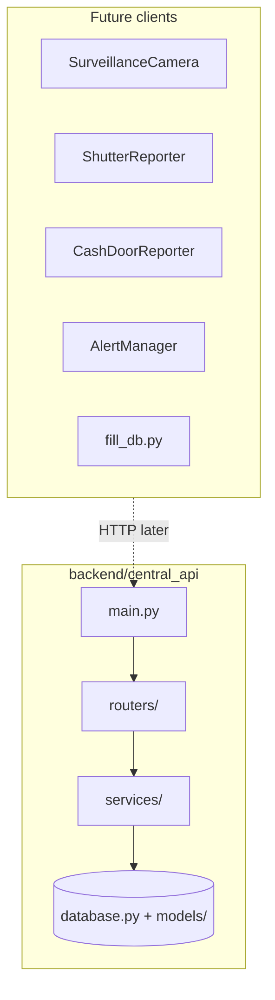

# Central DB FastAPI — Architecture

This document matches the **Backend FastAPI Central DB** plan: async SQLAlchemy ORM, Pydantic schemas, routers, services with additive sync semantics aligned to `src/common/db_helpers/central_db_helper.py`. Future clients (surveillance pipeline, reporters, `fill_db.py`) can call this API via an HTTP adapter; today they may still use `CentralDBHelper` directly.

**Dashboard / frontend engineers:** use **[Frontend developer guide](#frontend-developer-guide)** and **[HTTP endpoint reference](#http-endpoint-reference)** below. The canonical contract is **`GET /openapi.json`** (or Swagger UI at **`/docs`**).

## High-level flow



## Layer responsibilities

| Layer | Location | Role |
|-------|----------|------|
| **App** | `main.py` | FastAPI instance, lifespan (`init_db` / `dispose_db`), CORS, router mounts under `/api/v1`, optional `/metrics`. |
| **Config** | `config.py` | `pydantic-settings`: `DATABASE_URL`, `API_KEY`, `REQUIRE_API_KEY_FOR_READS`, `CORS_ORIGINS`. |
| **Persistence** | `database.py` | Async engine, `AsyncSession` factory, declarative `Base`. |
| **Auth** | `dependencies.py` | `get_db`, `verify_api_key` (writes), `verify_api_key_for_reads` (optional on GETs). |
| **HTTP** | `routers/*.py` | Path/query/body validation, dependencies, call services. |
| **Domain** | `services/*.py` | Upserts, additive sync, queries (mirrors `CentralDBHelper` behavior). |
| **ORM** | `models/*.py` | Table names and columns aligned with existing central DB schema. |
| **Contracts** | `schemas/*.py` | Pydantic request/response models. |

## Directory layout

```
backend/
  central_api/
    main.py
    config.py
    database.py
    dependencies.py
    models/
      __init__.py
      branch.py
      employee.py
      shutter_working_time.py
      alert_info.py
      alert_receiver.py
      attendance.py
      customer.py
      shutter_event.py
      cash_door_event.py
      alert.py
    schemas/
      branch.py, employee.py, attendance.py, customer.py,
      shutter.py, cash_door.py, alert.py, ...
    routers/
      branches.py       # branch, employees, shutter-schedule
      attendance.py     # list, summary, sync
      customers.py      # list, summary, sync
      shutter.py        # events + status
      cash_door.py      # events + status
      alerts.py         # branch alerts + /alerts/info + alert-receivers
      health.py         # /health, /ready (+ /metrics via instrumentator)
    services/
      branch_service.py
      attendance_service.py
      customer_service.py
      shutter_service.py
      cash_door_service.py
      alert_service.py
  requirements.txt
```

## API surface (`/api/v1` + health)

Branch-scoped resources use the path prefix **`/api/v1/branches/{branch_id}/...`** so the URL reflects ownership. OpenAPI **tags** group endpoints by domain (branches, attendance, customers, etc.) in Swagger.

| Area | Paths (after `/api/v1`) | Notes |
|------|-------------------------|--------|
| **Branches** | `GET /branches/{id}`, `POST /branches` (body includes `branch_id`), `GET/POST /branches/{id}/employees`, `GET/POST /branches/{id}/shutter-schedule` | Upsert by PK; shutter schedule **GET** requires query `day` (e.g. `Monday`); times as `H:MM:SS` / `HH:MM:SS`. |
| **Attendance** | `GET /branches/{id}/attendance`, `POST .../attendance/sync`, `GET .../attendance/summary` | Sync: additive `disk_hours` / `total_hours`, min `first_time_seen`, max `last_time_seen`. |
| **Customers** | `GET /branches/{id}/customers`, `POST .../customers/sync`, `GET .../customers/summary` | Sync: additive `service_time` / `waiting_time`. |
| **Shutter** | `POST/GET /branches/{id}/shutter/events`, `GET .../shutter/status` | Pagination on list. |
| **Cash door** | `POST/GET /branches/{id}/cash-door/events`, `GET .../cash-door/status` | Same pattern as shutter. |
| **Alerts** | `POST/GET /branches/{id}/alerts`, `GET/POST /alerts/info`, `GET/POST /branches/{id}/alert-receivers` | Alert definitions global; **GET** alert-receivers returns **all** receivers (global table; `branch_id` in path is for URL consistency only). |
| **Health** | `GET /health`, `GET /ready` at **root** (no `/api/v1`) | `GET /metrics` if `prometheus-fastapi-instrumentator` is installed. |

List endpoints support **`limit`** and **`offset`** where applicable (defaults **`limit=100`**, **`offset=0`**, max **`limit=500`**).

## Frontend developer guide

### Base URL and discovery

- Deployed **origin** is environment-specific (e.g. local dev often `http://127.0.0.1:8001` if you start Uvicorn on that port).
- **`GET /openapi.json`** — machine-readable OpenAPI 3 schema (use for codegen: Orval, openapi-typescript, etc.).
- **`GET /docs`** — Swagger UI (human-friendly, same contract as `openapi.json`).
- JSON request bodies: **`Content-Type: application/json`**. UTF-8.

### Authentication (`dependencies.py` + `config.py`)

| Condition | What to send |
|-----------|----------------|
| `API_KEY` is **empty** | No key required (typical local dev). |
| `API_KEY` is **set** | Send header **`X-API-Key: <value>`** on **POST** and other mutating routes that use `verify_api_key`. |
| `REQUIRE_API_KEY_FOR_READS=true` and `API_KEY` is set | Send **`X-API-Key`** on **GET** routes that use `verify_api_key_for_reads`. |

**Unauthenticated probes:** **`GET /health`** and **`GET /ready`** do not use API key dependencies.

Common error: **`401`** with body detail `"Invalid or missing API key"`.

### CORS

`CORSMiddleware` is enabled. Allowed origins come from **`CORS_ORIGINS`** (comma-separated list in env / `backend/.env`; default **`*`**). For a browser-based dashboard in production, set this to the dashboard origin(s) instead of `*`.

### Dates, times, and pagination

- Query and JSON **dates**: ISO **8601 date** `YYYY-MM-DD`.
- JSON **datetimes**: ISO **8601** strings (e.g. `2025-03-24T14:30:00`).
- **Shutter schedule** body fields `opening_time` / `partial_time` / `closing_time`: strings matching `H:MM:SS` or `HH:MM:SS`.
- **Pagination** (where supported): `limit` (1–500, default **100**), `offset` (≥ 0, default **0**).

### HTTP status codes (typical)

| Code | When |
|------|------|
| **200** | OK (many GETs and upserts). |
| **201** | Created (e.g. new shutter event, cash door event, alert). |
| **401** | Missing/invalid API key when auth is required. |
| **404** | e.g. unknown `branch_id` for **GET** branch; shutter schedule row missing for **GET** `shutter-schedule`. |
| **422** | Validation error (Pydantic); response includes field-level details. |

### Contract source in this repo

Pydantic models under **`central_api/schemas/`** define request/response bodies (e.g. `BranchUpsert`, `AttendanceSyncPayload`, `ShutterEventCreate`). Prefer **`openapi.json`** over duplicating fields here.

## HTTP endpoint reference

Full paths from the server root. **Auth:** **Write** = `verify_api_key` when `API_KEY` is set. **Read** = `verify_api_key_for_reads` only when `REQUIRE_API_KEY_FOR_READS` and `API_KEY` are set.

| Method | Path | Auth | Description |
|--------|------|------|-------------|
| GET | `/health` | — | Liveness: `{ "status": "ok" }`. |
| GET | `/ready` | — | Readiness: DB ping, `{ "status": "ready" }`. |
| GET | `/metrics` | — | Prometheus metrics (only if instrumentator installed). |
| GET | `/api/v1/branches/{branch_id}` | Read | Single branch. |
| POST | `/api/v1/branches` | Write | Upsert branch; body `BranchUpsert`. |
| GET | `/api/v1/branches/{branch_id}/employees` | Read | List employees. |
| POST | `/api/v1/branches/{branch_id}/employees` | Write | Upsert employee; body `EmployeeUpsert`. |
| GET | `/api/v1/branches/{branch_id}/shutter-schedule` | Read | Query **`day`** required (e.g. `Monday`). |
| POST | `/api/v1/branches/{branch_id}/shutter-schedule` | Write | Upsert schedule; body `ShutterScheduleUpsert`. |
| GET | `/api/v1/branches/{branch_id}/attendance` | Read | Query: `date`, `employee_id`, `limit`, `offset`. |
| POST | `/api/v1/branches/{branch_id}/attendance/sync` | Write | Body `{ "records": [ ... ] }` (`AttendanceRecord`). |
| GET | `/api/v1/branches/{branch_id}/attendance/summary` | Read | Query: `date_from`, `date_to`. |
| GET | `/api/v1/branches/{branch_id}/customers` | Read | Query: `date`, `customer_id`, `limit`, `offset`. |
| POST | `/api/v1/branches/{branch_id}/customers/sync` | Write | Body `{ "records": [ ... ] }` (`CustomerRecord`). |
| GET | `/api/v1/branches/{branch_id}/customers/summary` | Read | Query: `date_from`, `date_to`. |
| POST | `/api/v1/branches/{branch_id}/shutter/events` | Write | Body `ShutterEventCreate`. **201**. |
| GET | `/api/v1/branches/{branch_id}/shutter/events` | Read | Query: `date`, `event_type`, `limit`, `offset`. |
| GET | `/api/v1/branches/{branch_id}/shutter/status` | Read | Latest shutter state (may be null fields if none). |
| POST | `/api/v1/branches/{branch_id}/cash-door/events` | Write | Body `CashDoorEventCreate`. **201**. |
| GET | `/api/v1/branches/{branch_id}/cash-door/events` | Read | Query: `date`, `event_type`, `limit`, `offset`. |
| GET | `/api/v1/branches/{branch_id}/cash-door/status` | Read | Latest cash door state. |
| POST | `/api/v1/branches/{branch_id}/alerts` | Write | Body `AlertCreate`. **201**. |
| GET | `/api/v1/branches/{branch_id}/alerts` | Read | Query: `date`, `alert_type`, `limit`, `offset`. |
| GET | `/api/v1/alerts/info` | Read | List alert type definitions. |
| POST | `/api/v1/alerts/info` | Write | Upsert alert info; body `AlertInfoUpsert`. |
| GET | `/api/v1/branches/{branch_id}/alert-receivers` | Read | Lists **all** receivers (global). |
| POST | `/api/v1/branches/{branch_id}/alert-receivers` | Write | Upsert receiver; body `AlertReceiverUpsert`. |

## Schema and sync semantics

- **Source of truth** for table shapes: `src/common/db_helpers/central_db_helper.py` (same names as legacy SQLite/Oracle DDL, e.g. `create_central_db.sql`).
- **Attendance / customer sync** implements the same **additive upsert** as `_additive_upsert` / `_sync_employees` / `_sync_customers`: on conflict, add hours/times, keep earliest `first_time_seen`, latest `last_time_seen`.

## Out of scope (separate phases)

- HTTP client adapter replacing `CentralDBHelper` internals.
- Alembic migrations (optional follow-up; dev may use `create_all` from ORM metadata).

## Swagger vs FastAPI VS Code extension

- **Swagger UI** (`/docs`) groups operations by **OpenAPI `tags`** (e.g. `branches`, `attendance`, `alerts`). Those come from each `APIRouter(..., tags=[...])` and from `openapi_tags` on the `FastAPI()` app.
- The official **FastAPI extension** (Path Operation Explorer) builds its tree from **router objects and `include_router` links**, not from OpenAPI tags. There is **no setting** today to group by **source file** or to mirror Swagger’s tag grouping ([extension README](https://github.com/fastapi/fastapi-vscode): *“organized by router”*).
- **Why everything lands under one “branches” branch in the explorer:** the extension flattens routers, then **merges any two `APIRouter` instances that share the same composed path prefix**. Most domain routers here use `APIRouter(prefix="/branches")` and are mounted with `prefix="/api/v1"`, so they all share **`/api/v1/branches`** and are merged into a **single** tree node—even though the code lives in `attendance.py`, `customers.py`, etc. That is **by design in the extension** (`buildPrefixHierarchy` in `fastapi-vscode`), not something this repo can fix without **changing public URL structure** (so each router gets a distinct prefix) or an **upstream feature** (e.g. “do not merge routers with different `filePath`”).
- **Practical options:** use **`/docs`** for tag-based grouping; use the extension’s **Search Path Operations**; open a route from the explorer and use **Go to Definition** / the shown **file:line** for the handler. For file-centric listings, generate or script against **`openapi.json`** if you need automation.

The **FastAPI VS Code extension** resolves `[tool.fastapi].entrypoint` in **`backend/pyproject.toml`** (`central_api.main:app` paths relative to `backend/`). Do **not** set `fastapi.entryPoint` to `central_api.main:app` when the workspace root is the monorepo: the extension would look for `central_api/main.py` at the repo root and fail. With `backend/pyproject.toml`, discovery works whether you open the repo root or the `backend` folder.

## Related files in the monorepo

- Legacy DB helper: `src/common/db_helpers/central_db_helper.py`
- DDL reference: `src/common/sql/create_central_db.sql`
